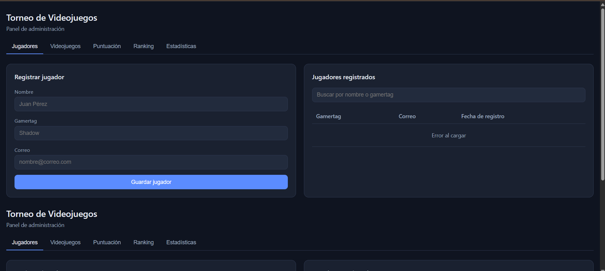
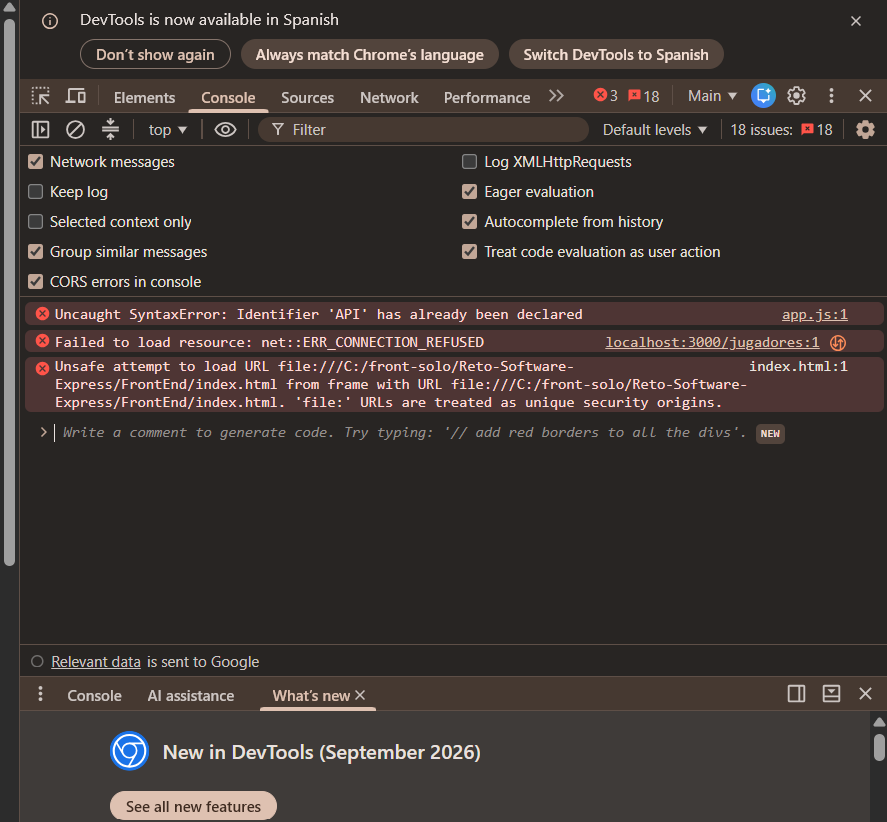

Reporte QA del frontend

\- Responsable: Luis Fernando Núñez Chan.

\- Rama evaluada: feature/frontend.

\- Commit evaluado: 9c34f11.

\- Entorno: Windows y Google Chrome.

\- Ejecución: apertura local de FrontEnd/index.html mediante file://.

\- Alcance: presentación inicial y navegación hacia Videojuegos.

\- Estado general: revisión parcial, con errores pendientes.

CP-FE-001: Presentación inicial

Procedimiento

1\. Abrir FrontEnd/index.html en Chrome.

2\. Revisar la pantalla inicial de Jugadores.

3\. Abrir la consola de herramientas de desarrollo.

\### Resultado esperado

Mostrar una sola interfaz, con un encabezado, un menú y

el panel de Jugadores, sin errores de redeclaración de JavaScript.

\### Resultado obtenido

La interfaz aparece duplicada: se repiten el encabezado,

el menú y el contenido de Jugadores.

La consola muestra:

Uncaught SyntaxError: Identifier 'API' has already been declared.

Estado

FALLIDO.

Evidencias

CP-FE-002: Navegación hacia Videojuegos

Procedimiento

1\. Desde la pantalla inicial, pulsar Videojuegos en el menú superior.

2\. Observar el panel mostrado y la sección duplicada inferior.

Resultado esperado

La pestaña Videojuegos queda seleccionada y se muestra su panel,

manteniendo un único encabezado y un único menú.

Resultado obtenido

El botón responde y muestra el formulario Registrar videojuego

y la tabla Videojuegos registrados en la sección superior.

El encabezado y el menú duplicados permanecen en la sección inferior.

La tabla muestra "Error al cargar"; no se verificó la consulta de datos.

Estado

FALLIDO respecto a la presentación única.

El cambio al panel superior de Videojuegos sí respondió.

Evidencia

BUG-FE-001: Documento HTML duplicado

\- Detectado en: CP-FE-001 y CP-FE-002.

\- Causa identificada en revisión de código: index.html contiene

&#x20; dos documentos HTML completos y carga app.js dos veces.

\- Efectos observados: interfaz duplicada y error de redeclaración de API.

\- Severidad: alta, por afectar la interfaz y la ejecución del script.

\- Responsable de corrección: Frontend.

\- Corrección propuesta: conservar un solo documento HTML,

&#x20; identificadores únicos y una sola carga de app.js.

\- Estado: pendiente de corrección.

\- Reprueba: pendiente.

Limitaciones del entorno

\- La consola muestra ERR\_CONNECTION\_REFUSED hacia localhost:3000.

&#x20; El backend no está disponible en el entorno de prueba.

\- La carga de datos y la persistencia en MySQL no fueron verificadas.

\- La consola también muestra una restricción relacionada con file://.

&#x20; Se debe repetir la prueba mediante un servidor HTTP local.

\- Estos mensajes no se consideran por sí solos errores del frontend.

Pendientes para la siguiente sesión

1\. Verificar la corrección de BUG-FE-001.

2\. Repetir presentación y navegación mediante un servidor HTTP local.

3\. Probar campos obligatorios y mensajes de validación.

4\. Probar las demás pestañas.

5\. Cuando el backend funcione, verificar registros, búsquedas,

&#x20;  ranking y estadísticas con datos reales de MySQL.

Cierre de la sesión

Se ejecutaron dos casos de prueba y se documentó un defecto

que afecta ambos. No se aprueba todavía el frontend completo

ni la integración del sistema.

